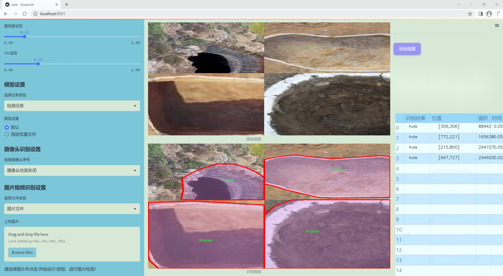
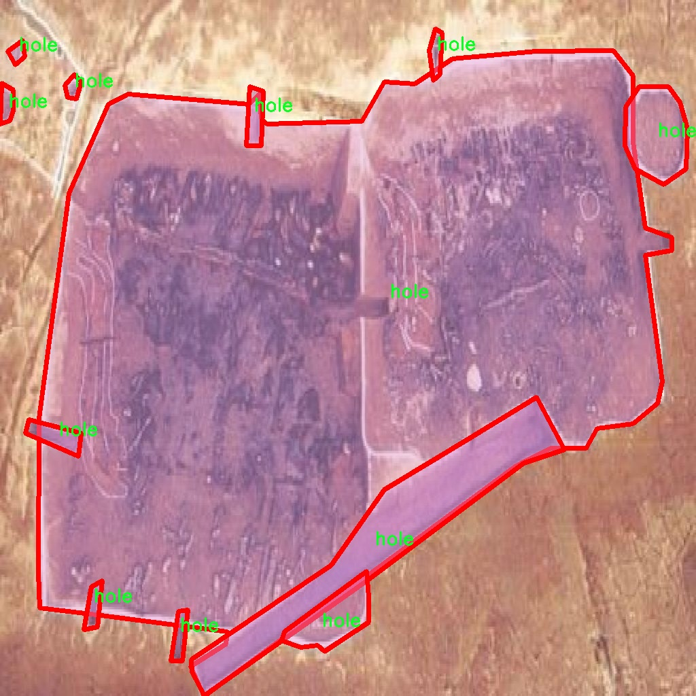

### 1.背景意义

研究背景与意义

随着工业自动化和智能制造的快速发展，孔洞检测作为关键的质量控制环节，受到了广泛关注。孔洞的存在可能会影响产品的强度、密封性和整体性能，因此，准确、快速地检测孔洞对于保障产品质量至关重要。传统的孔洞检测方法多依赖于人工检查或简单的图像处理技术，这些方法不仅效率低下，而且容易受到人为因素的影响，导致检测结果的不一致性和不可靠性。因此，开发一种基于先进计算机视觉技术的自动化孔洞检测系统显得尤为重要。

近年来，深度学习技术的飞速发展为图像识别和目标检测提供了新的解决方案。YOLO（You Only Look Once）系列模型因其高效的实时检测能力而广泛应用于各种视觉任务。特别是YOLOv11的改进版本，凭借其在准确性和速度上的优越表现，成为了研究者们关注的焦点。本项目旨在基于改进的YOLOv11模型，构建一个高效的孔洞检测系统，以实现对工业产品中孔洞的快速、准确检测。

为实现这一目标，我们将使用一个包含1500张经过标注的孔洞图像的数据集。该数据集专门针对孔洞这一单一类别进行了优化，确保模型能够专注于识别和定位孔洞特征。通过对数据集的精细处理和增强，我们期望提高模型的鲁棒性和泛化能力，使其在不同环境和条件下均能保持高效的检测性能。

本研究不仅将推动孔洞检测技术的发展，还将为相关领域的智能检测系统提供有力的技术支持，具有重要的理论意义和实际应用价值。通过这一项目，我们希望能够为工业生产提供更加智能化的解决方案，提升产品质量和生产效率。

### 2.视频效果

[2.1 视频效果](https://www.bilibili.com/video/BV1rukjYFE75/)

### 3.图片效果




##### [项目涉及的源码数据来源链接](https://kdocs.cn/l/cszuIiCKVNis)**

注意：本项目提供训练的数据集和训练教程,由于版本持续更新,暂不提供权重文件（best.pt）,请按照6.训练教程进行训练后实现上图演示的效果。

### 4.数据集信息

##### 4.1 本项目数据集类别数＆类别名

nc: 1
names: ['hole']


该项目为【图像分割】数据集，请在【训练教程和Web端加载模型教程（第三步）】这一步的时候按照【图像分割】部分的教程来训练

##### 4.2 本项目数据集信息介绍

本项目数据集信息介绍

本项目旨在通过改进YOLOv11算法，构建一个高效的孔洞检测系统，以满足工业检测和质量控制的需求。为此，我们构建了一个专门针对孔洞检测的训练数据集，命名为“holes-resize”。该数据集专注于识别和分类不同尺寸和形状的孔洞，涵盖了实际应用中可能遇到的各种情况。数据集中包含的类别数量为1，具体类别为“hole”，这一设计使得模型能够专注于该特定目标的检测与识别。

在数据集的构建过程中，我们收集了大量具有代表性的孔洞图像，这些图像来源于不同的工业场景，包括但不限于制造业、建筑业和材料检测等领域。为了确保数据集的多样性和广泛性，我们对孔洞的尺寸、形状、背景和光照条件进行了精心设计，确保模型在训练过程中能够接触到丰富的样本，从而提高其泛化能力和检测精度。此外，为了增强数据集的实用性，我们还对图像进行了适当的预处理和增强，例如旋转、缩放和亮度调整，以模拟实际应用中可能遇到的各种情况。

通过使用该数据集进行训练，我们期望改进后的YOLOv11模型能够在孔洞检测任务中表现出色，能够快速、准确地识别出不同尺寸和形状的孔洞。这将为相关行业提供更为高效的检测工具，降低人工检测的成本，提高产品质量和生产效率。我们相信，这一数据集的构建和应用将为孔洞检测技术的发展提供重要的支持和推动力。





### 5.全套项目环境部署视频教程（零基础手把手教学）

[5.1 所需软件PyCharm和Anaconda安装教程（第一步）](https://www.bilibili.com/video/BV1BoC1YCEKi/?spm_id_from=333.999.0.0&vd_source=bc9aec86d164b67a7004b996143742dc)


[5.2 安装Python虚拟环境创建和依赖库安装视频教程（第二步）](https://www.bilibili.com/video/BV1ZoC1YCEBw?spm_id_from=333.788.videopod.sections&vd_source=bc9aec86d164b67a7004b996143742dc)

### 6.改进YOLOv11训练教程和Web_UI前端加载模型教程（零基础手把手教学）

[6.1 改进YOLOv11训练教程和Web_UI前端加载模型教程（第三步）](https://www.bilibili.com/video/BV1BoC1YCEhR?spm_id_from=333.788.videopod.sections&vd_source=bc9aec86d164b67a7004b996143742dc)


按照上面的训练视频教程链接加载项目提供的数据集，运行train.py即可开始训练



     Epoch   gpu_mem       box       obj       cls    labels  img_size
     1/200     20.8G   0.01576   0.01955  0.007536        22      1280: 100%|██████████| 849/849 [14:42<00:00,  1.04s/it]
               Class     Images     Labels          P          R     mAP@.5 mAP@.5:.95: 100%|██████████| 213/213 [01:14<00:00,  2.87it/s]
                 all       3395      17314      0.994      0.957      0.0957      0.0843

     Epoch   gpu_mem       box       obj       cls    labels  img_size
     2/200     20.8G   0.01578   0.01923  0.007006        22      1280: 100%|██████████| 849/849 [14:44<00:00,  1.04s/it]
               Class     Images     Labels          P          R     mAP@.5 mAP@.5:.95: 100%|██████████| 213/213 [01:12<00:00,  2.95it/s]
                 all       3395      17314      0.996      0.956      0.0957      0.0845

     Epoch   gpu_mem       box       obj       cls    labels  img_size
     3/200     20.8G   0.01561    0.0191  0.006895        27      1280: 100%|██████████| 849/849 [10:56<00:00,  1.29it/s]
               Class     Images     Labels          P          R     mAP@.5 mAP@.5:.95: 100%|███████   | 187/213 [00:52<00:00,  4.04it/s]
                 all       3395      17314      0.996      0.957      0.0957      0.0845


###### [项目数据集下载链接](https://kdocs.cn/l/cszuIiCKVNis)

### 7.原始YOLOv11算法讲解


##### YOLOv11三大损失函数

YOLOv11（You Only Look Once）是一种流行的目标检测算法，其损失函数设计用于同时优化分类和定位任务。YOLO的损失函数通常包括几个部分：
**分类损失、定位损失（边界框回归损失）和置信度损失** 。其中，

  1. box_loss（边界框回归损失）是用于优化预测边界框与真实边界框之间的差异的部分。

  2. cls_loss（分类损失）是用于优化模型对目标类别的预测准确性的部分。分类损失确保模型能够正确地识别出图像中的对象属于哪个类别。

  3. dfl_loss（Distribution Focal Loss）是YOLO系列中的一种损失函数，特别是在一些改进版本如YOLOv5和YOLOv7中被引入。它的主要目的是解决目标检测中的类别不平衡问题，并提高模型在处理小目标和困难样本时的性能。

##### 边界框回归损失详解

box_loss（边界框回归损失）是用于优化预测边界框与真实边界框之间的差异的部分。


##### box_loss 的具体意义


##### 为什么需要 box_loss

  * 精确定位：通过最小化中心点坐标损失和宽高损失，模型能够更准确地预测目标的位置和大小。
  * 平衡不同类型的目标：使用平方根来处理宽高损失，可以更好地平衡不同大小的目标，确保小目标也能得到足够的关注。
  * 稳定训练：适当的损失函数设计有助于模型的稳定训练，避免梯度爆炸或消失等问题。

##### 分类损失详解

在YOLO（You Only Look
Once）目标检测算法中，cls_loss（分类损失）是用于优化模型对目标类别的预测准确性的部分。分类损失确保模型能够正确地识别出图像中的对象属于哪个类别。下面是关于cls_loss的详细解读：

##### 分类损失 (cls_loss) 的具体意义

  
分类损失通常使用交叉熵损失（Cross-Entropy
Loss）来计算。交叉熵损失衡量的是模型预测的概率分布与真实标签之间的差异。在YOLO中，分类损失的具体形式如下：


##### 为什么需要 cls_loss

  * 类别识别：cls_loss 确保模型能够正确识别出图像中的目标属于哪个类别。这对于目标检测任务至关重要，因为不仅需要知道目标的位置，还需要知道目标的类型。

  * 多类别支持：通过最小化分类损失，模型可以处理多个类别的目标检测任务。例如，在道路缺陷检测中，可能需要识别裂缝、坑洞、路面破损等多种类型的缺陷。

  * 提高准确性：分类损失有助于提高模型的分类准确性，从而提升整体检测性能。通过优化分类损失，模型可以更好地学习不同类别之间的特征差异。

##### 分布损失详解

`dfl_loss`（Distribution Focal
Loss）是YOLO系列中的一种损失函数，特别是在一些改进版本如YOLOv5和YOLOv7中被引入。它的主要目的是解决目标检测中的类别不平衡问题，并提高模型在处理小目标和困难样本时的性能。下面是对`dfl_loss`的详细解读：

##### DFL Loss 的背景

在目标检测任务中，类别不平衡是一个常见的问题。某些类别的样本数量可能远远多于其他类别，这会导致模型在训练过程中对常见类别的学习效果较好，而对罕见类别的学习效果较差。此外，小目标和困难样本的检测也是一个挑战，因为这些目标通常具有较少的特征信息，容易被忽略或误分类。

为了应对这些问题，研究者们提出了多种改进方法，其中之一就是`dfl_loss`。`dfl_loss`通过引入分布焦点损失来增强模型对困难样本的关注，并改善类别不平衡问题。

##### DFL Loss 的定义

DFL Loss
通常与传统的交叉熵损失结合使用，以增强模型对困难样本的学习能力。其核心思想是通过对每个类别的预测概率进行加权，使得模型更加关注那些难以正确分类的样本。

DFL Loss 的公式可以表示为：


##### DFL Loss 的具体意义**

  * **类别不平衡：** 通过引入平衡因子 α，DFL Loss 可以更好地处理类别不平衡问题。对于少数类别的样本，可以通过增加其权重来提升其重要性，从而提高模型对这些类别的检测性能。
  *  **困难样本：** 通过聚焦参数 γ，DFL Loss 可以让模型更加关注那些难以正确分类的样本。当 
  * γ 较大时，模型会对那些预测概率较低的样本给予更多的关注，从而提高这些样本的分类准确性。
  *  **提高整体性能** ：DFL Loss 结合了传统交叉熵损失的优势，并通过加权机制增强了模型对困难样本的学习能力，从而提高了整体的检测性能。


### 8.200+种全套改进YOLOV11创新点原理讲解

#### 8.1 200+种全套改进YOLOV11创新点原理讲解大全

由于篇幅限制，每个创新点的具体原理讲解就不全部展开，具体见下列网址中的改进模块对应项目的技术原理博客网址【Blog】（创新点均为模块化搭建，原理适配YOLOv5~YOLOv11等各种版本）

[改进模块技术原理博客【Blog】网址链接](https://gitee.com/qunmasj/good)


#### 8.2 精选部分改进YOLOV11创新点原理讲解

###### 这里节选部分改进创新点展开原理讲解(完整的改进原理见上图和[改进模块技术原理博客链接](https://gitee.com/qunmasj/good)【如果此小节的图加载失败可以通过CSDN或者Github搜索该博客的标题访问原始博客，原始博客图片显示正常】
### CBAM空间注意力机制
近年来，随着深度学习研究方向的火热，注意力机制也被广泛地应用在图像识别、语音识别和自然语言处理等领域，注意力机制在深度学习任务中发挥着举足轻重的作用。注意力机制借鉴于人类的视觉系统，例如，人眼在看到一幅画面时，会倾向于关注画面中的重要信息，而忽略其他可见的信息。深度学习中的注意力机制和人类视觉的注意力机制相似，通过扫描全局数据，从大量数据中选择出需要重点关注的、对当前任务更为重要的信息，然后对这部分信息分配更多的注意力资源，从这些信息中获取更多所需要的细节信息，而抑制其他无用的信息。而在深度学习中，则具体表现为给感兴趣的区域更高的权重，经过网络的学习和调整，得到最优的权重分配，形成网络模型的注意力，使网络拥有更强的学习能力，加快网络的收敛速度。
注意力机制通常可分为软注意力机制和硬注意力机制[4-5]。软注意力机制在选择信息时，不是从输入的信息中只选择1个，而会用到所有输入信息，只是各个信息对应的权重分配不同，然后输入网络模型进行计算;硬注意力机制则是从输入的信息中随机选取一个或者选择概率最高的信息，但是这一步骤通常是不可微的，导致硬注意力机制更难训练。因此，软注意力机制应用更为广泛，按照原理可将软注意力机制划分为:通道注意力机制（channel attention)、空间注意力机制(spatial attention）和混合域注意力机制(mixed attention)。
通道注意力机制的本质建立各个特征通道之间的重要程度，对感兴趣的通道进行重点关注，弱化不感兴趣的通道的作用;空间注意力的本质则是建模了整个空间信息的重要程度，然后对空间内感兴趣的区域进行重点关注，弱化其余非感兴趣区域的作用;混合注意力同时运用了通道注意力和空间注意力，两部分先后进行或并行，形成对通道特征和空间特征同时关注的注意力模型。

卷积层注意力模块(Convolutional Block Attention Module，CBAM）是比较常用的混合注意力模块，其先后集中了通道注意力模块和空间注意力模块，网络中加入该模块能有效提高网络性能，减少网络模型的计算量，模块结构如图所示。输入特征图首先经过分支的通道注意力模块，然后和主干的原特征图融合，得到具有通道注意力的特征图，接着经过分支的空间注意力模块，在和主干的特征图融合后，得到同时具有通道特征注意力和空间特征注意力的特征图。CBAM模块不改变输入特征图的大小，因此该模块是一个“即插即用”的模块，可以插入网络的任何位置。

通道注意力模块的结构示意图如图所示，通道注意力模块分支并行地对输入的特征图进行最大池化操作和平均池化操作，然后利用多层感知机对结果进行变换，得到应用于两个通道的变换结果，最后经过sigmoid激活函数将变换结果融合，得到具有通道注意力的通道特征图。

空间注意力模块示意图如图所示，将通道注意力模块输出的特征图作为该模块的输入特征图，首先对输入特征图进行基于通道的最大池化操作和平均池化操作，将两部分得到的结果拼接起来，然后通过卷积得到降为Ⅰ通道的特征图，最后通过sigmoid激活函数生成具有空间注意力的特征图。


### 9.系统功能展示

图9.1.系统支持检测结果表格显示

  图9.2.系统支持置信度和IOU阈值手动调节

  图9.3.系统支持自定义加载权重文件best.pt(需要你通过步骤5中训练获得)

  图9.4.系统支持摄像头实时识别

  图9.5.系统支持图片识别

  图9.6.系统支持视频识别

  图9.7.系统支持识别结果文件自动保存

  图9.8.系统支持Excel导出检测结果数据


### 10. YOLOv11核心改进源码讲解

#### 10.1 kaln_conv.py

以下是对给定代码的核心部分进行分析和详细注释的结果。代码的主要功能是实现一种基于Legendre多项式的卷积层，支持1D、2D和3D卷积。

```python
from functools import lru_cache
import torch
import torch.nn as nn
from torch.nn.functional import conv3d, conv2d, conv1d

class KALNConvNDLayer(nn.Module):
    def __init__(self, conv_class, norm_class, conv_w_fun, input_dim, output_dim, degree, kernel_size,
                 groups=1, padding=0, stride=1, dilation=1, dropout: float = 0.0, ndim: int = 2):
        super(KALNConvNDLayer, self).__init__()
        
        # 初始化参数
        self.inputdim = input_dim  # 输入维度
        self.outdim = output_dim    # 输出维度
        self.degree = degree        # 多项式的阶数
        self.kernel_size = kernel_size  # 卷积核大小
        self.padding = padding      # 填充
        self.stride = stride        # 步幅
        self.dilation = dilation    # 膨胀
        self.groups = groups        # 分组卷积的组数
        self.base_activation = nn.SiLU()  # 基础激活函数
        self.conv_w_fun = conv_w_fun  # 卷积权重函数
        self.ndim = ndim            # 数据的维度
        self.dropout = None         # Dropout层

        # 初始化Dropout层
        if dropout > 0:
            if ndim == 1:
                self.dropout = nn.Dropout1d(p=dropout)
            elif ndim == 2:
                self.dropout = nn.Dropout2d(p=dropout)
            elif ndim == 3:
                self.dropout = nn.Dropout3d(p=dropout)

        # 检查参数有效性
        if groups <= 0:
            raise ValueError('groups must be a positive integer')
        if input_dim % groups != 0:
            raise ValueError('input_dim must be divisible by groups')
        if output_dim % groups != 0:
            raise ValueError('output_dim must be divisible by groups')

        # 创建基础卷积层和归一化层
        self.base_conv = nn.ModuleList([conv_class(input_dim // groups,
                                                   output_dim // groups,
                                                   kernel_size,
                                                   stride,
                                                   padding,
                                                   dilation,
                                                   groups=1,
                                                   bias=False) for _ in range(groups)])

        self.layer_norm = nn.ModuleList([norm_class(output_dim // groups) for _ in range(groups)])

        # 初始化多项式权重
        poly_shape = (groups, output_dim // groups, (input_dim // groups) * (degree + 1)) + tuple(
            kernel_size for _ in range(ndim))
        self.poly_weights = nn.Parameter(torch.randn(*poly_shape))

        # 使用Kaiming均匀分布初始化卷积层和多项式权重
        for conv_layer in self.base_conv:
            nn.init.kaiming_uniform_(conv_layer.weight, nonlinearity='linear')
        nn.init.kaiming_uniform_(self.poly_weights, nonlinearity='linear')

    @lru_cache(maxsize=128)  # 使用缓存避免重复计算Legendre多项式
    def compute_legendre_polynomials(self, x, order):
        # 计算Legendre多项式
        P0 = x.new_ones(x.shape)  # P0 = 1
        if order == 0:
            return P0.unsqueeze(-1)
        P1 = x  # P1 = x
        legendre_polys = [P0, P1]

        # 递归计算高阶多项式
        for n in range(1, order):
            Pn = ((2.0 * n + 1.0) * x * legendre_polys[-1] - n * legendre_polys[-2]) / (n + 1.0)
            legendre_polys.append(Pn)

        return torch.concatenate(legendre_polys, dim=1)

    def forward_kal(self, x, group_index):
        # 前向传播
        base_output = self.base_conv[group_index](x)  # 基础卷积输出

        # 将输入x归一化到[-1, 1]范围
        x_normalized = 2 * (x - x.min()) / (x.max() - x.min()) - 1 if x.shape[0] > 0 else x

        # 应用Dropout
        if self.dropout is not None:
            x_normalized = self.dropout(x_normalized)

        # 计算Legendre多项式
        legendre_basis = self.compute_legendre_polynomials(x_normalized, self.degree)
        # 使用多项式权重进行卷积
        poly_output = self.conv_w_fun(legendre_basis, self.poly_weights[group_index],
                                      stride=self.stride, dilation=self.dilation,
                                      padding=self.padding, groups=1)

        # 合并基础输出和多项式输出
        x = base_output + poly_output
        if isinstance(self.layer_norm[group_index], nn.LayerNorm):
            orig_shape = x.shape
            x = self.layer_norm[group_index](x.view(orig_shape[0], -1)).view(orig_shape)
        else:
            x = self.layer_norm[group_index](x)
        x = self.base_activation(x)  # 应用激活函数

        return x

    def forward(self, x):
        # 前向传播处理所有组
        split_x = torch.split(x, self.inputdim // self.groups, dim=1)
        output = []
        for group_ind, _x in enumerate(split_x):
            y = self.forward_kal(_x.clone(), group_ind)
            output.append(y.clone())
        y = torch.cat(output, dim=1)  # 拼接所有组的输出
        return y

# 1D、2D、3D卷积层的具体实现
class KALNConv3DLayer(KALNConvNDLayer):
    def __init__(self, input_dim, output_dim, kernel_size, degree=3, groups=1, padding=0, stride=1, dilation=1,
                 dropout: float = 0.0):
        super(KALNConv3DLayer, self).__init__(nn.Conv3d, nn.InstanceNorm3d, conv3d,
                                              input_dim, output_dim,
                                              degree, kernel_size,
                                              groups=groups, padding=padding, stride=stride, dilation=dilation,
                                              ndim=3, dropout=dropout)

class KALNConv2DLayer(KALNConvNDLayer):
    def __init__(self, input_dim, output_dim, kernel_size, degree=3, groups=1, padding=0, stride=1, dilation=1,
                 dropout: float = 0.0, norm_layer=nn.InstanceNorm2d):
        super(KALNConv2DLayer, self).__init__(nn.Conv2d, norm_layer, conv2d,
                                              input_dim, output_dim,
                                              degree, kernel_size,
                                              groups=groups, padding=padding, stride=stride, dilation=dilation,
                                              ndim=2, dropout=dropout)

class KALNConv1DLayer(KALNConvNDLayer):
    def __init__(self, input_dim, output_dim, kernel_size, degree=3, groups=1, padding=0, stride=1, dilation=1,
                 dropout: float = 0.0):
        super(KALNConv1DLayer, self).__init__(nn.Conv1d, nn.InstanceNorm1d, conv1d,
                                              input_dim, output_dim,
                                              degree, kernel_size,
                                              groups=groups, padding=padding, stride=stride, dilation=dilation,
                                              ndim=1, dropout=dropout)
```

### 代码分析和注释总结
1. **KALNConvNDLayer**：这是一个通用的多维卷积层，支持1D、2D和3D卷积。它使用Legendre多项式进行卷积操作，允许用户定义卷积参数和归一化层。
2. **构造函数**：初始化输入输出维度、卷积参数、分组卷积、Dropout等。还创建了基础卷积层和归一化层，并初始化多项式权重。
3. **compute_legendre_polynomials**：计算Legendre多项式，使用递归关系生成高阶多项式，并缓存结果以提高效率。
4. **forward_kal**：执行前向传播，处理每个分组的输入，计算基础卷积输出和多项式输出，并进行归一化和激活。
5. **forward**：处理所有分组的输入，将它们拼接成最终输出。
6. **KALNConv1DLayer、KALNConv2DLayer、KALNConv3DLayer**：分别是1D、2D和3D卷积层的具体实现，继承自KALNConvNDLayer。

这些注释和分析帮助理解代码的结构和功能，便于后续的维护和扩展。

这个程序文件定义了一个用于多维卷积神经网络的模块，主要包括一个基类 `KALNConvNDLayer` 和三个子类 `KALNConv3DLayer`、`KALNConv2DLayer` 和 `KALNConv1DLayer`，分别用于处理三维、二维和一维卷积操作。

在 `KALNConvNDLayer` 类的构造函数中，首先初始化了一些参数，包括输入和输出维度、卷积核大小、分组数、填充、步幅、扩张、丢弃率等。该类使用了 `nn.ModuleList` 来存储多个卷积层和归一化层，支持分组卷积的实现。还定义了一个多项式权重参数 `poly_weights`，用于后续的多项式卷积计算。

该类的 `compute_legendre_polynomials` 方法用于计算勒让德多项式，这是一种用于多项式卷积的数学工具。该方法使用了递归关系来生成多项式，并通过 `lru_cache` 装饰器进行缓存，以提高计算效率。

在 `forward_kal` 方法中，首先对输入进行基础卷积操作，然后对输入进行归一化处理，以便于计算勒让德多项式。接着计算勒让德多项式，并使用预定义的多项式权重进行卷积操作。最后，将基础卷积输出和多项式卷积输出相加，并通过归一化和激活函数进行处理。

`forward` 方法则是将输入按照分组进行切分，并对每个分组调用 `forward_kal` 方法进行处理，最后将所有分组的输出拼接在一起。

`KALNConv3DLayer`、`KALNConv2DLayer` 和 `KALNConv1DLayer` 这三个子类分别继承自 `KALNConvNDLayer`，并在构造函数中指定了相应的卷积类和归一化类，以便于处理不同维度的数据。

整体来看，这个文件实现了一个灵活且强大的多维卷积层，能够根据输入的维度自动选择相应的卷积和归一化操作，并结合勒让德多项式进行复杂的特征提取。

#### 10.2 afpn.py

以下是保留的核心代码部分，并附上详细的中文注释：

```python
import torch
import torch.nn as nn
import torch.nn.functional as F

# 定义基本的卷积块
class BasicBlock(nn.Module):
    def __init__(self, filter_in, filter_out):
        super(BasicBlock, self).__init__()
        # 定义两个卷积层
        self.conv1 = nn.Conv2d(filter_in, filter_out, kernel_size=3, padding=1)
        self.conv2 = nn.Conv2d(filter_out, filter_out, kernel_size=3, padding=1, bias=False)

    def forward(self, x):
        residual = x  # 保存输入以便后续加法
        out = self.conv1(x)  # 第一个卷积层
        out = self.conv2(out)  # 第二个卷积层
        out += residual  # 残差连接
        return F.relu(out)  # 激活函数

# 定义上采样模块
class Upsample(nn.Module):
    def __init__(self, in_channels, out_channels, scale_factor=2):
        super(Upsample, self).__init__()
        # 定义上采样的卷积层和上采样操作
        self.upsample = nn.Sequential(
            nn.Conv2d(in_channels, out_channels, kernel_size=1),
            nn.Upsample(scale_factor=scale_factor, mode='bilinear', align_corners=False)
        )

    def forward(self, x):
        return self.upsample(x)  # 上采样操作

# 定义下采样模块
class Downsample_x2(nn.Module):
    def __init__(self, in_channels, out_channels):
        super(Downsample_x2, self).__init__()
        # 定义下采样的卷积层
        self.downsample = nn.Conv2d(in_channels, out_channels, kernel_size=2, stride=2)

    def forward(self, x):
        return self.downsample(x)  # 下采样操作

# 定义自适应特征融合模块（ASFF）
class ASFF_2(nn.Module):
    def __init__(self, inter_dim=512):
        super(ASFF_2, self).__init__()
        compress_c = 8  # 压缩通道数

        # 定义用于计算权重的卷积层
        self.weight_level_1 = nn.Conv2d(inter_dim, compress_c, kernel_size=1)
        self.weight_level_2 = nn.Conv2d(inter_dim, compress_c, kernel_size=1)
        self.weight_levels = nn.Conv2d(compress_c * 2, 2, kernel_size=1)  # 计算融合权重
        self.conv = nn.Conv2d(inter_dim, inter_dim, kernel_size=3, padding=1)  # 最后的卷积层

    def forward(self, input1, input2):
        # 计算输入特征的权重
        level_1_weight_v = self.weight_level_1(input1)
        level_2_weight_v = self.weight_level_2(input2)

        # 合并权重并计算softmax
        levels_weight_v = torch.cat((level_1_weight_v, level_2_weight_v), 1)
        levels_weight = self.weight_levels(levels_weight_v)
        levels_weight = F.softmax(levels_weight, dim=1)

        # 融合特征
        fused_out_reduced = input1 * levels_weight[:, 0:1, :, :] + input2 * levels_weight[:, 1:2, :, :]
        out = self.conv(fused_out_reduced)  # 最后的卷积操作
        return out

# 定义特征金字塔网络（AFPN）
class AFPN_P345(nn.Module):
    def __init__(self, in_channels=[256, 512, 1024], out_channels=256, factor=4):
        super(AFPN_P345, self).__init__()
        # 定义输入通道到输出通道的卷积层
        self.conv0 = nn.Conv2d(in_channels[0], in_channels[0] // factor, kernel_size=1)
        self.conv1 = nn.Conv2d(in_channels[1], in_channels[1] // factor, kernel_size=1)
        self.conv2 = nn.Conv2d(in_channels[2], in_channels[2] // factor, kernel_size=1)

        # 定义特征处理模块
        self.body = BlockBody_P345([in_channels[0] // factor, in_channels[1] // factor, in_channels[2] // factor])

        # 定义输出卷积层
        self.conv00 = nn.Conv2d(in_channels[0] // factor, out_channels, kernel_size=1)
        self.conv11 = nn.Conv2d(in_channels[1] // factor, out_channels, kernel_size=1)
        self.conv22 = nn.Conv2d(in_channels[2] // factor, out_channels, kernel_size=1)

    def forward(self, x):
        x0, x1, x2 = x  # 分别获取输入特征
        x0 = self.conv0(x0)  # 处理输入特征
        x1 = self.conv1(x1)
        x2 = self.conv2(x2)

        out0, out1, out2 = self.body([x0, x1, x2])  # 通过特征处理模块

        out0 = self.conv00(out0)  # 输出处理
        out1 = self.conv11(out1)
        out2 = self.conv22(out2)
        return [out0, out1, out2]  # 返回处理后的特征
```

### 代码说明
1. **BasicBlock**: 这是一个基本的卷积块，包含两个卷积层和一个残差连接。
2. **Upsample 和 Downsample**: 这两个类用于实现上采样和下采样操作，分别使用卷积和插值方法。
3. **ASFF_2**: 自适应特征融合模块，通过计算输入特征的权重来融合不同尺度的特征。
4. **AFPN_P345**: 特征金字塔网络的实现，包含多个卷积层和特征处理模块，能够处理多尺度的特征输入并输出相应的特征图。

这个程序文件 `afpn.py` 实现了一种特定的神经网络结构，主要用于图像处理任务，尤其是在目标检测和分割等领域。文件中定义了多个类和模块，构成了一个自适应特征金字塔网络（AFPN）的基础。

首先，文件导入了一些必要的库，包括 `torch` 和 `torch.nn`，这些是构建深度学习模型的基础库。`OrderedDict` 用于有序字典的创建，方便后续的模块管理。

接下来，定义了多个基础模块，包括 `BasicBlock`、`Upsample`、`Downsample_x2`、`Downsample_x4`、`Downsample_x8`，这些模块分别实现了基本的卷积操作、上采样和下采样功能。`BasicBlock` 类实现了一个包含两个卷积层的基本块，并且使用残差连接来帮助训练更深的网络。`Upsample` 和 `Downsample` 类则实现了不同倍数的上采样和下采样操作，分别用于调整特征图的尺寸。

`ASFF`（Adaptive Spatial Feature Fusion）模块的实现分为 `ASFF_2`、`ASFF_3` 和 `ASFF_4`，这些模块用于融合来自不同尺度的特征图。通过计算每个输入特征图的权重并进行加权融合，能够有效地整合多尺度信息，从而提升模型的表现。

`BlockBody_P345` 和 `BlockBody_P2345` 类是网络的主体结构，分别处理三层和四层特征图。它们通过组合多个卷积块和 ASFF 模块来构建深层网络结构。在这些类中，特征图在不同的尺度间进行上下采样和融合，以便更好地捕捉图像中的信息。

`AFPN_P345` 和 `AFPN_P2345` 类则是具体的网络实现，分别对应三层和四层特征金字塔网络。它们在初始化时设置输入和输出通道，并定义网络的整体结构。每个网络的前向传播方法都负责处理输入特征图，并返回经过处理后的特征图。

最后，`BlockBody_P345_Custom` 和 `BlockBody_P2345_Custom` 类允许用户自定义网络中的基本块类型，这样可以根据不同的需求选择不同的卷积块结构。

整体而言，这个文件实现了一个灵活且强大的特征金字塔网络结构，能够适应不同的输入特征图和任务需求，具有良好的扩展性和可定制性。

#### 10.3 CSwomTramsformer.py

以下是提取后的核心代码部分，并附上详细的中文注释：

```python
import torch
import torch.nn as nn
import numpy as np

class Mlp(nn.Module):
    """多层感知机（MLP）模块"""
    def __init__(self, in_features, hidden_features=None, out_features=None, act_layer=nn.GELU, drop=0.):
        super().__init__()
        out_features = out_features or in_features  # 输出特征数
        hidden_features = hidden_features or in_features  # 隐藏层特征数
        self.fc1 = nn.Linear(in_features, hidden_features)  # 第一层线性变换
        self.act = act_layer()  # 激活函数
        self.fc2 = nn.Linear(hidden_features, out_features)  # 第二层线性变换
        self.drop = nn.Dropout(drop)  # Dropout层

    def forward(self, x):
        """前向传播"""
        x = self.fc1(x)  # 线性变换
        x = self.act(x)  # 激活
        x = self.drop(x)  # Dropout
        x = self.fc2(x)  # 线性变换
        x = self.drop(x)  # Dropout
        return x

class CSWinBlock(nn.Module):
    """CSWin Transformer的基本块"""
    def __init__(self, dim, num_heads, mlp_ratio=4., drop=0., attn_drop=0., norm_layer=nn.LayerNorm):
        super().__init__()
        self.dim = dim  # 输入特征维度
        self.num_heads = num_heads  # 注意力头数
        self.mlp_ratio = mlp_ratio  # MLP的隐藏层比率
        self.qkv = nn.Linear(dim, dim * 3)  # 线性变换生成Q、K、V
        self.norm1 = norm_layer(dim)  # 归一化层
        self.attn = LePEAttention(dim, num_heads=num_heads, attn_drop=attn_drop)  # 注意力层
        self.mlp = Mlp(in_features=dim, hidden_features=int(dim * mlp_ratio), out_features=dim)  # MLP层
        self.norm2 = norm_layer(dim)  # 归一化层

    def forward(self, x):
        """前向传播"""
        img = self.norm1(x)  # 归一化
        qkv = self.qkv(img).reshape(x.shape[0], -1, 3, self.dim).permute(2, 0, 1, 3)  # 生成Q、K、V
        x = self.attn(qkv)  # 注意力计算
        x = x + self.mlp(self.norm2(x))  # 加上MLP的输出
        return x

class CSWinTransformer(nn.Module):
    """CSWin Transformer模型"""
    def __init__(self, img_size=640, in_chans=3, num_classes=1000, embed_dim=96, depth=[2,2,6,2], num_heads=12):
        super().__init__()
        self.num_classes = num_classes  # 类别数
        self.embed_dim = embed_dim  # 嵌入维度
        self.stage1_conv_embed = nn.Sequential(
            nn.Conv2d(in_chans, embed_dim, 7, 4, 2),  # 卷积层
            nn.LayerNorm(embed_dim)  # 归一化层
        )
        self.stage1 = nn.ModuleList([
            CSWinBlock(dim=embed_dim, num_heads=num_heads) for _ in range(depth[0])  # 堆叠CSWinBlock
        ])
        # 其他阶段的初始化略去

    def forward(self, x):
        """前向传播"""
        x = self.stage1_conv_embed(x)  # 初始卷积嵌入
        for blk in self.stage1:
            x = blk(x)  # 通过每个块
        return x

# 示例代码，创建模型并进行前向传播
if __name__ == '__main__':
    inputs = torch.randn((1, 3, 640, 640))  # 输入张量
    model = CSWinTransformer()  # 创建模型
    res = model(inputs)  # 前向传播
    print(res.size())  # 输出结果的尺寸
```

### 代码说明：
1. **Mlp类**：实现了一个简单的多层感知机，包含两个线性层和一个激活函数，支持Dropout。
2. **CSWinBlock类**：实现了CSWin Transformer的基本构建块，包含注意力机制和MLP。
3. **CSWinTransformer类**：整体模型结构，包含输入卷积层和多个CSWinBlock的堆叠。
4. **前向传播**：模型通过输入数据进行前向传播，输出特征。

该代码实现了CSWin Transformer的基本结构，适用于图像分类等任务。

这个程序文件 `CSWinTransformer.py` 实现了 CSWin Transformer 模型，这是一个用于计算机视觉任务的深度学习模型。文件的结构主要包括模型的定义、辅助类和函数，以及一些用于创建不同规模模型的工厂函数。

首先，文件引入了必要的库，包括 PyTorch 和一些来自 timm 库的工具。接着，定义了几个重要的类。

`Mlp` 类实现了一个多层感知机（MLP），包含两个线性层和一个激活函数（默认为 GELU），并在每个线性层后添加了 dropout 层，以防止过拟合。

`LePEAttention` 类实现了一个局部增强的自注意力机制。该类通过将输入的特征图转换为窗口形式，来计算自注意力。它的构造函数接受多个参数，包括输入维度、分辨率、头数等，并定义了用于计算注意力的卷积层和 dropout 层。`forward` 方法实现了注意力的计算过程。

`CSWinBlock` 类是 CSWin Transformer 的基本构建块，它结合了自注意力机制和 MLP。该类的构造函数定义了输入的维度、头数、分辨率等参数，并初始化了注意力层和 MLP。`forward` 方法则实现了前向传播过程，计算输入的注意力输出并通过 MLP 进行处理。

`img2windows` 和 `windows2img` 函数用于在图像和窗口之间进行转换，方便进行自注意力计算。

`Merge_Block` 类用于在不同阶段之间合并特征图，通过卷积层和归一化层来处理特征。

`CSWinTransformer` 类是整个模型的核心，它定义了输入图像的处理流程，包括卷积嵌入、多个 CSWinBlock 的堆叠以及特征的合并。构造函数中设置了模型的各个阶段，并根据输入的参数初始化相应的层。`forward_features` 方法用于提取特征，而 `forward` 方法则是模型的前向传播入口。

此外，文件中还定义了一些辅助函数，例如 `_conv_filter` 用于转换权重，`update_weight` 用于更新模型权重，以及几个用于创建不同规模的 CSWin Transformer 模型的工厂函数（如 `CSWin_tiny`, `CSWin_small`, `CSWin_base`, `CSWin_large`）。

最后，在 `__main__` 部分，代码演示了如何使用不同规模的 CSWin Transformer 模型进行推理，生成随机输入并输出各个模型的特征图尺寸。

整体来看，这个文件实现了一个复杂的视觉 Transformer 模型，结合了自注意力机制和卷积操作，适用于各种计算机视觉任务。

#### 10.4 head.py

以下是代码中最核心的部分，经过简化并添加了详细的中文注释：

```python
import torch
import torch.nn as nn
import torch.nn.functional as F
from ultralytics.utils.tal import dist2bbox, make_anchors

class Detect_DyHead(nn.Module):
    """YOLOv8 检测头，使用动态头进行目标检测。"""
    
    def __init__(self, nc=80, hidc=256, block_num=2, ch=()):
        super().__init__()
        self.nc = nc  # 类别数量
        self.nl = len(ch)  # 检测层数量
        self.reg_max = 16  # DFL通道数量
        self.no = nc + self.reg_max * 4  # 每个锚点的输出数量
        self.stride = torch.zeros(self.nl)  # 在构建过程中计算的步幅
        c2, c3 = max((16, ch[0] // 4, self.reg_max * 4)), max(ch[0], self.nc)  # 通道数
        
        # 定义卷积层
        self.conv = nn.ModuleList(nn.Sequential(Conv(x, hidc, 1)) for x in ch)
        self.dyhead = nn.Sequential(*[DyHeadBlock(hidc) for _ in range(block_num)])  # 动态头块
        self.cv2 = nn.ModuleList(
            nn.Sequential(Conv(hidc, c2, 3), Conv(c2, c2, 3), nn.Conv2d(c2, 4 * self.reg_max, 1)) for _ in ch
        )
        self.cv3 = nn.ModuleList(
            nn.Sequential(
                nn.Sequential(DWConv(hidc, x, 3), Conv(x, c3, 1)),
                nn.Sequential(DWConv(c3, c3, 3), Conv(c3, c3, 1)),
                nn.Conv2d(c3, self.nc, 1),
            )
            for x in ch
        )
        self.dfl = DFL(self.reg_max) if self.reg_max > 1 else nn.Identity()  # DFL层

    def forward(self, x):
        """前向传播，返回预测的边界框和类别概率。"""
        for i in range(self.nl):
            x[i] = self.conv[i](x[i])  # 通过卷积层处理输入
        x = self.dyhead(x)  # 通过动态头处理特征
        shape = x[0].shape  # 获取输出形状
        
        for i in range(self.nl):
            # 将 cv2 和 cv3 的输出进行拼接
            x[i] = torch.cat((self.cv2[i](x[i]), self.cv3[i](x[i])), 1)
        
        # 如果在训练模式下，直接返回处理后的特征
        if self.training:
            return x
        
        # 动态调整锚点和步幅
        self.anchors, self.strides = (x.transpose(0, 1) for x in make_anchors(x, self.stride, 0.5))
        
        # 将特征展平并分割为边界框和类别
        x_cat = torch.cat([xi.view(shape[0], self.no, -1) for xi in x], 2)
        box, cls = x_cat.split((self.reg_max * 4, self.nc), 1)  # 分割为边界框和类别
        
        # 解码边界框
        dbox = dist2bbox(self.dfl(box), self.anchors.unsqueeze(0), xywh=True, dim=1) * self.strides
        y = torch.cat((dbox, cls.sigmoid()), 1)  # 返回边界框和经过sigmoid处理的类别概率
        return y

    def bias_init(self):
        """初始化检测头的偏置，要求步幅可用。"""
        for a, b, s in zip(self.cv2, self.cv3, self.stride):
            a[-1].bias.data[:] = 1.0  # 边界框偏置初始化为1
            b[-1].bias.data[:self.nc] = math.log(5 / self.nc / (640 / s) ** 2)  # 类别偏置初始化
```

### 代码说明：
1. **Detect_DyHead 类**：这是 YOLOv8 的检测头，使用动态头进行目标检测。它负责处理输入特征并生成边界框和类别概率。
2. **构造函数 (`__init__`)**：初始化检测头的参数，包括类别数量、隐藏通道、检测层数量等，并定义卷积层和动态头块。
3. **前向传播 (`forward`)**：处理输入特征，经过卷积层和动态头，最终生成边界框和类别概率。
4. **偏置初始化 (`bias_init`)**：初始化边界框和类别的偏置值，确保模型在训练时的稳定性。

这个简化版本保留了核心逻辑，并添加了详细的中文注释，便于理解代码的功能和实现。

这个文件 `head.py` 是一个实现 YOLOv8 检测头的 PyTorch 模块，包含多个类和方法，用于目标检测、分割和姿态估计等任务。文件中定义了多个检测头类，主要包括 `Detect_DyHead`、`Detect_AFPN_P345`、`Detect_Efficient` 等，这些类继承自 `nn.Module`，并实现了不同的前向传播逻辑和网络结构。

首先，文件导入了一些必要的库，包括 `torch` 和 `torch.nn`，以及一些自定义模块和函数。接着，定义了一个名为 `Detect_DyHead` 的类，它是 YOLOv8 的检测头，具有动态网格重建和导出模式的功能。该类的构造函数接受类别数、隐藏通道数、块数量和通道配置等参数，并初始化了多个卷积层和动态头块。

在 `forward` 方法中，输入的特征图经过卷积和动态头块处理后，生成预测的边界框和类别概率。该方法还处理了训练和推理模式下的不同逻辑，包括动态锚框的生成和输出格式的调整。

接下来，文件中定义了多个继承自 `Detect_DyHead` 的类，例如 `Detect_DyHeadWithDCNV3` 和 `Detect_DyHeadWithDCNV4`，这些类实现了不同的动态头块变体。类似地，`Detect_AFPN_P345` 和 `Detect_AFPN_P345_Custom` 等类实现了基于自适应特征金字塔网络（AFPN）的检测头。

文件中还定义了一些轻量级和高效的检测头类，如 `Detect_Efficient` 和 `Detect_LSCD`，这些类通过共享卷积和轻量化设计来提高模型的效率。每个检测头类都有自己的前向传播逻辑，处理输入特征并生成输出。

此外，文件中还实现了用于姿态估计和分割的检测头类，如 `Pose_LSCD` 和 `Segment_LSCD`，这些类在检测头的基础上增加了处理关键点和分割掩码的功能。

最后，文件中包含了一些用于初始化偏置和解码边界框的辅助方法，确保模型在训练和推理过程中能够正确处理数据。整体而言，这个文件实现了 YOLOv8 的多个检测头，支持多种任务和模型变体，具有灵活性和可扩展性。

### 11.完整训练+Web前端界面+200+种全套创新点源码、数据集获取


# [下载链接：https://mbd.pub/o/bread/Z5yamZ1u](https://mbd.pub/o/bread/Z5yamZ1u)